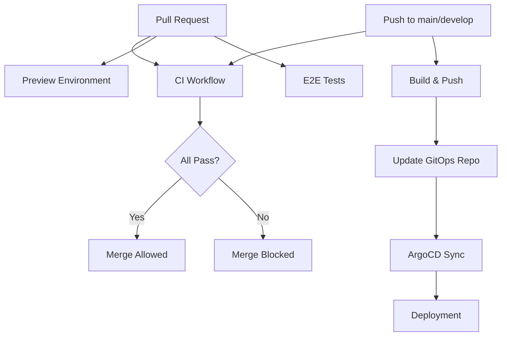

# GitHub Actions Workflows

This directory contains all CI/CD workflows for the Mosaic Life platform.

## Workflows Overview

### 🧪 [CI Workflow](./ci.yml)
**File**: `ci.yml`
**Triggers**: Pull requests, pushes to main/develop

Runs comprehensive quality checks:
- Frontend: Lint, type check, unit tests, build
- Backend: Lint, type check, unit tests
- Security: Gitleaks, dependency scanning, Bandit
- Contract: API schema validation

### 🐳 [Build and Push](./build-push.yml)
**File**: `build-push.yml`
**Triggers**: Pushes to main/develop, version tags

Builds and publishes Docker images:
- Builds web and core-api images
- Pushes to Amazon ECR
- Generates SBOM (Software Bill of Materials)
- Scans for vulnerabilities with Grype
- Signs images with Cosign
- Updates GitOps repository with new image tags

### 🚀 [Preview Environment](./preview-env.yml)
**File**: `preview-env.yml`
**Triggers**: Pull request open/update/close

Manages ephemeral preview environments:
- Deploys to dedicated namespace per PR
- Creates DNS records (pr-{number}.mosaiclife.me)
- Comments on PR with preview URLs
- Automatically cleans up on PR close

### 🎭 [E2E Tests](./e2e-tests.yml)
**File**: `e2e-tests.yml`
**Triggers**: PRs, pushes, nightly schedule

Runs end-to-end tests:
- Playwright browser tests
- Accessibility tests (axe-core)
- Performance tests (K6, Lighthouse)

## Workflow Dependencies



## Required Secrets

No secrets needed! We use **OIDC (OpenID Connect)** for AWS authentication.

### Optional Secrets

- `GITOPS_PAT`: GitHub Personal Access Token for GitOps repository updates (only for build-push workflow)

## Required IAM Roles

Set up using CloudFormation in `infra/iam/github-actions-oidc.yaml`:

1. **github-actions-ecr-push**: Push Docker images to ECR
2. **github-actions-eks-deploy**: Deploy to EKS cluster
3. **github-actions-kubectl-role**: Execute kubectl commands

## Environment Variables

All workflows use these environment variables:

```yaml
env:
  AWS_REGION: us-east-1
  ECR_REGISTRY: 033691785857.dkr.ecr.us-east-1.amazonaws.com
  EKS_CLUSTER: mosaiclife-eks
  NODE_VERSION: '20.x'
  PYTHON_VERSION: '3.12'
```

## Adding a New Workflow

1. Create workflow file in `.github/workflows/`
2. Define triggers and jobs
3. Add documentation to this README
4. Test with manual dispatch first
5. Update CI/CD documentation

## Workflow Templates

### Basic CI Workflow Template

```yaml
name: My New Workflow
on:
  pull_request:
    branches: [main, develop]
jobs:
  my-job:
    name: My Job
    runs-on: ubuntu-latest
    steps:
      - uses: actions/checkout@v4
      - name: Run my task
        run: echo "Hello World"
```

### AWS OIDC Template

```yaml
jobs:
  deploy:
    permissions:
      id-token: write
      contents: read
    steps:
      - name: Configure AWS credentials
        uses: aws-actions/configure-aws-credentials@v4
        with:
          role-to-assume: arn:aws:iam::033691785857:role/github-actions-ecr-push
          aws-region: us-east-1
```

## Monitoring Workflows

### View Recent Runs

```bash
gh run list --limit 10
```

### View Specific Run

```bash
gh run view <run-id> --log
```

### Re-run Failed Jobs

```bash
gh run rerun <run-id>
```

### Manual Trigger

```bash
gh workflow run build-push.yml --ref main
```

## Troubleshooting

### Workflow Fails to Assume IAM Role

**Error**: `User is not authorized to perform: sts:AssumeRoleWithWebIdentity`

**Fix**: Verify OIDC provider and trust relationship:
```bash
aws iam get-role --role-name github-actions-ecr-push \
  --query 'Role.AssumeRolePolicyDocument'
```

### Preview Environment Deploy Fails

**Error**: `Error from server (Forbidden): namespaces is forbidden`

**Fix**: Check EKS RBAC configuration:
```bash
kubectl get configmap aws-auth -n kube-system -o yaml
kubectl get clusterrolebinding github-actions-deploy
```

### Image Push to ECR Fails

**Error**: `denied: User is not authorized to perform ecr:PutImage`

**Fix**: Verify ECR repository exists and IAM role has permissions:
```bash
aws ecr describe-repositories --repository-names mosaic-life/web
aws iam get-role-policy --role-name github-actions-ecr-push --policy-name ECRPushPolicy
```

## Best Practices

1. **Keep workflows DRY**: Use reusable workflows for common tasks
2. **Security first**: Never commit credentials, use OIDC
3. **Fast feedback**: Run quick checks first, slow checks later
4. **Artifact preservation**: Upload test results and reports
5. **Fail fast**: Use `continue-on-error: false` by default
6. **Resource limits**: Set timeouts to prevent runaway jobs
7. **Cache dependencies**: Use cache actions for faster builds

## Metrics

Track these workflow metrics:

- **Success rate**: % of successful workflow runs
- **Duration**: Average time to complete
- **Frequency**: Runs per day/week
- **Cost**: GitHub Actions minutes consumed

View metrics:
```bash
# Last 30 days of workflow runs
gh run list --created $(date -d '30 days ago' +%Y-%m-%d)

# Failed runs only
gh run list --status failure
```

## Related Documentation

- [CI/CD Overview](../../docs/cicd/README.md)
- [Quick Start Guide](../../docs/cicd/QUICK-START.md)
- [IAM Setup](../../infra/iam/setup-instructions.md)
- [ArgoCD Configuration](../../infra/argocd/README.md)
- [Coding Standards](../../docs/developer/CODING-STANDARDS.md)

## Support

For workflow issues:
1. Check this documentation
2. Review workflow logs: `gh run view <run-id> --log`
3. Check [troubleshooting guide](../../docs/cicd/README.md#troubleshooting)
4. Open issue with `cicd` label
