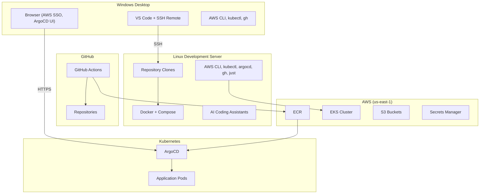
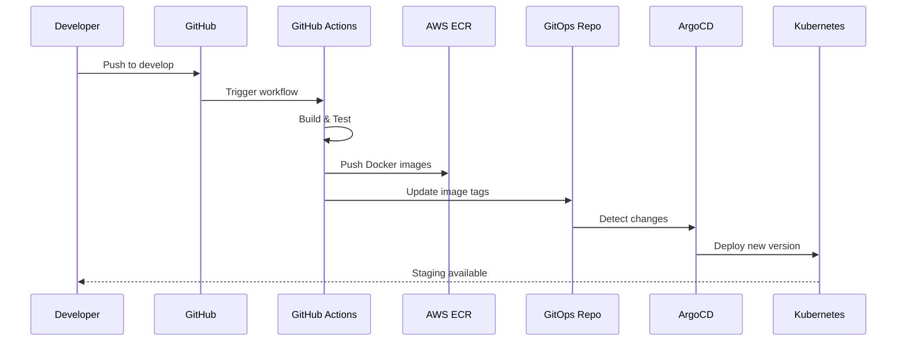

# Developer Environment Setup

This comprehensive guide covers everything you need to set up a complete development environment for the Mosaic Life platform, including multi-system configuration, AWS authentication, Kubernetes access, and CI/CD workflows.

## Architecture Overview

The Mosaic Life development workflow uses a multi-repository, multi-system architecture:



### Repository Structure

Clone the following repositories under `/apps`:

| Repository | Local Path | Purpose |
|------------|------------|---------|
| [mosaic-stories/mosaic-life](https://github.com/mosaic-stories/mosaic-life) | `/apps/mosaic-life` | Main application (web, API, docs) |
| [mosaic-stories/infrastructure](https://github.com/mosaic-stories/infrastructure) | `/apps/mosaic-life-infrastructure` | AWS/EKS infrastructure (CDK, eksctl) |
| [mosaic-stories/gitops](https://github.com/mosaic-stories/gitops) | `/apps/mosaic-life-gitops` | Deployment configurations |

## System Requirements

### Linux Development Server (Ubuntu)

This is your primary development environment, accessed via VS Code SSH Remote.

#### Required Tools

| Tool | Installation | Purpose |
|------|--------------|---------|
| Docker | `sudo apt install docker.io` | Container runtime |
| Docker Compose | `sudo apt install docker-compose-plugin` | Local orchestration |
| AWS CLI v2 | [AWS CLI Install Guide](https://docs.aws.amazon.com/cli/latest/userguide/getting-started-install.html) | AWS authentication |
| kubectl | `sudo snap install kubectl --classic` | Kubernetes CLI |
| eksctl | [eksctl Installation](https://eksctl.io/installation/) | EKS cluster management |
| ArgoCD CLI | [ArgoCD CLI Install](https://argo-cd.readthedocs.io/en/stable/cli_installation/) | GitOps deployments |
| GitHub CLI | `sudo apt install gh` | GitHub operations |
| Git | `sudo apt install git` | Version control |
| just | `cargo install just` or [Pre-built binaries](https://github.com/casey/just/releases) | Task runner |
| Node.js 20+ | [NodeSource](https://github.com/nodesource/distributions) | Frontend development |
| Python 3.12+ | `sudo apt install python3.12` | Backend development |
| uv | `curl -LsSf https://astral.sh/uv/install.sh \| sh` | Python package manager |
| jq | `sudo apt install jq` | JSON processing |
| yq | `sudo snap install yq` | YAML processing |
| ripgrep | `sudo apt install ripgrep` | Fast search |

#### Docker Post-Installation

```bash
# Add your user to the docker group
sudo usermod -aG docker $USER

# Log out and back in, then verify
docker run hello-world
```

### Windows Desktop

This is your IDE and browser access point.

#### Required Tools

| Tool | Installation | Purpose |
|------|--------------|---------|
| VS Code | [Download](https://code.visualstudio.com/) | IDE |
| VS Code Remote - SSH | Extension marketplace | Connect to Linux server |
| AWS CLI v2 | [MSI Installer](https://awscli.amazonaws.com/AWSCLIV2.msi) | AWS SSO authentication |
| kubectl | `winget install Kubernetes.kubectl` | Kubernetes CLI (port-forward) |
| Git | [Git for Windows](https://git-scm.com/download/win) | Version control |

#### VS Code Extensions (Recommended)

- Remote - SSH
- Docker
- GitLens
- Python
- ESLint
- Prettier
- YAML

## Repository Setup

### Clone Repositories (Linux)

```bash
# Create apps directory
mkdir -p /apps
cd /apps

# Clone main application
git clone https://github.com/mosaic-stories/mosaic-life.git
cd mosaic-life
git checkout develop  # Development branch
cd ..

# Clone infrastructure
git clone https://github.com/mosaic-stories/infrastructure.git mosaic-life-infrastructure
cd mosaic-life-infrastructure
git checkout main
cd ..

# Clone GitOps
git clone https://github.com/mosaic-stories/gitops.git mosaic-life-gitops
cd mosaic-life-gitops
git checkout main
cd ..
```

### GitHub CLI Authentication

```bash
# Authenticate with GitHub
gh auth login

# Select:
# - GitHub.com
# - HTTPS
# - Login with a web browser

# Verify authentication
gh auth status
```

## AWS Authentication

### AWS SSO Setup (Recommended for Windows)

On your Windows desktop, configure AWS SSO for automatic credential refresh:

```powershell
# Configure SSO profile
aws configure sso
# SSO session name: mosaiclife
# SSO start URL: https://d-9067ae6582.awsapps.com/start
# SSO region: us-east-1
# SSO registration scopes: sso:account:access

# Login (opens browser)
aws sso login --profile mosaiclife

# Set as default
$env:AWS_PROFILE = "mosaiclife"
```

### Manual Credentials (Linux)

For the Linux development server, manually update credentials from AWS SSO portal:

1. Open browser: [https://d-9067ae6582.awsapps.com/start/#/?tab=accounts](https://d-9067ae6582.awsapps.com/start/#/?tab=accounts)
2. Select **MosaicLife** account
3. Click **Access Keys** next to **AdministratorAccess**
4. Copy the credentials

```bash
# Update credentials file
aws configure

# When prompted:
# AWS Access Key ID: <paste from SSO portal>
# AWS Secret Access Key: <paste from SSO portal>
# Default region name: us-east-1
# Default output format: json

# For session token (temporary credentials)
nano ~/.aws/credentials
# Add under [default]:
# aws_session_token = <paste session token>
```

Alternatively, use the quick export method:

```bash
# Copy the "Option 1: Set AWS environment variables" from SSO portal
export AWS_ACCESS_KEY_ID="..."
export AWS_SECRET_ACCESS_KEY="..."
export AWS_SESSION_TOKEN="..."
```

!!! warning "Session Expiration"
    AWS SSO credentials expire after 12 hours. You'll need to refresh them at the start of each coding session.

### Verify AWS Access

```bash
# Check identity
aws sts get-caller-identity

# Expected output:
# {
#     "UserId": "...",
#     "Account": "033691785857",
#     "Arn": "arn:aws:sts::033691785857:assumed-role/AWSReservedSSO_AdministratorAccess_..."
# }
```

## Kubernetes Configuration

### Configure kubectl

```bash
# Update kubeconfig for EKS cluster
aws eks update-kubeconfig --region us-east-1 --name mosaiclife-eks

# Verify connection
kubectl get nodes

# Expected output:
# NAME                          STATUS   ROLES    AGE   VERSION
# ip-10-20-xxx-xxx.ec2.internal Ready    <none>   ...   v1.33.x
```

### Using just Commands

The `/apps/mosaic-life/justfile` provides shortcuts:

```bash
cd /apps/mosaic-life

# Update kubeconfig
just kubeconfig

# View cluster info
just cluster-info

# List pods in application namespace
just pods
```

## ArgoCD Access

ArgoCD is not exposed publicly. Access it via port-forwarding.

### Port Forward Setup

=== "Linux (CLI Access)"

    ```bash
    cd /apps/mosaic-life

    # Start port-forward (runs in foreground)
    just argocd-ui
    # Or manually:
    kubectl port-forward svc/argocd-server -n argocd 8085:443

    # Get admin password
    just argocd-password

    # Login via CLI
    just argocd-login
    ```

=== "Windows (UI Access)"

    ```powershell
    # Start port-forward
    kubectl port-forward svc/argocd-server -n argocd 8085:443

    # Open browser: http://localhost:8085
    # Username: admin
    # Password: (get from Linux using just argocd-password)
    ```

### Dual Access Pattern

For effective development:

1. **Linux terminal**: Run `just argocd-ui` for CLI access
2. **Windows browser**: Port-forward and access `http://localhost:8085` for visual monitoring

```bash
# On Linux - Get password for Windows browser login
just argocd-password
```

### Common ArgoCD Commands

```bash
cd /apps/mosaic-life

# List applications
just argocd-list

# Check application status
just argocd-status mosaic-life-staging

# Sync (deploy) application
just argocd-sync mosaic-life-staging

# Watch sync progress
just argocd-watch mosaic-life-staging

# View diff before sync
just argocd-diff mosaic-life-staging
```

## Local Development

### Quick Start

```bash
cd /apps/mosaic-life

# Full setup (start services, run migrations, seed data)
just setup

# Or step by step:
just dev-up              # Start Docker Compose stack
just db-migrate          # Run database migrations
just seed                # Add sample data
```

### Service URLs

| Service | URL | Purpose |
|---------|-----|---------|
| Frontend (dev) | http://localhost:5173 | Vite dev server with HMR |
| Backend API | http://localhost:8080 | FastAPI backend |
| PostgreSQL | localhost:15432 | Database (user: postgres, db: core) |
| Documentation | http://localhost:8000 | MkDocs (with `--profile docs`) |
| Jaeger | http://localhost:16686 | Distributed tracing |
| OpenSearch | http://localhost:9200 | Search engine |

### Development Workflows

=== "Frontend Only"

    ```bash
    cd /apps/mosaic-life/apps/web
    npm install
    npm run dev
    ```

=== "Backend Only"

    ```bash
    cd /apps/mosaic-life/services/core-api
    uv sync
    uv run alembic upgrade head
    uv run python -m app.main
    ```

=== "Full Stack"

    ```bash
    cd /apps/mosaic-life
    just dev-up     # Start all services
    just logs       # Tail logs
    ```

=== "Documentation"

    ```bash
    cd /apps/mosaic-life
    just docs-serve   # Serve locally at :8000
    ```

### Database Operations

```bash
cd /apps/mosaic-life

# Access PostgreSQL shell
just db-shell

# Or directly:
docker compose -f infra/compose/docker-compose.yml exec postgres psql -U postgres -d core

# Run migrations
just db-migrate

# Create new migration
cd services/core-api
uv run alembic revision --autogenerate -m "add_new_table"
```

## CI/CD Workflow

### Branch Strategy

| Branch | Environment | Domain | Auto-Deploy |
|--------|-------------|--------|-------------|
| `develop` | Staging | stage.mosaiclife.me | Yes |
| `main` | Production | mosaiclife.me | Yes |
| `feature/*` | Preview | pr-{n}.mosaiclife.me | On PR |

### Deployment Flow



### Monitoring CI/CD

#### GitHub Actions

```bash
# List recent workflow runs
gh run list --repo mosaic-stories/mosaic-life

# View specific run
gh run view <run-id>

# Watch running workflow
gh run watch <run-id>

# View logs for failed job
gh run view <run-id> --log-failed
```

#### ArgoCD Status

```bash
cd /apps/mosaic-life

# Check all applications
just argocd-list

# Detailed status
just argocd-status mosaic-life-staging

# Watch sync progress
just argocd-watch mosaic-life-staging
```

### Troubleshooting Deployments

```bash
# View pod status
just pods

# Tail application logs
just logs core-api
just logs web

# Describe failing pod
kubectl describe pod -n mosaiclife <pod-name>

# Get events
kubectl get events -n mosaiclife --sort-by='.lastTimestamp'

# Execute into pod
just exec core-api bash
```

## Environment Domains

### Production

| Service | URL |
|---------|-----|
| Web Application | https://mosaiclife.me |
| API | https://api.mosaiclife.me |
| Documentation | https://docs.mosaiclife.me |

### Staging

| Service | URL |
|---------|-----|
| Web Application | https://stage.mosaiclife.me |
| API | https://stage-api.mosaiclife.me |
| Documentation | https://stage-docs.mosaiclife.me |

### Preview Environments

Preview environments are created automatically for pull requests:

- Web: `https://pr-{number}.mosaiclife.me`
- API: `https://pr-{number}-api.mosaiclife.me`

!!! note "Preview Environment Status"
    Preview environments are currently in development. Some workflow issues are being debugged.

## Code Quality & Validation

### Before Committing

```bash
cd /apps/mosaic-life

# Validate everything
just validate-all

# Or separately:
just validate-backend    # Ruff + MyPy
just validate-frontend   # ESLint + TypeScript

# Auto-fix issues
just lint-fix-backend
```

### Backend Validation

```bash
cd /apps/mosaic-life/services/core-api

# Linting
uv run ruff check .

# Type checking
uv run mypy app

# Format check
uv run ruff format --check .

# Auto-fix
uv run ruff check --fix .
uv run ruff format .
```

### Frontend Validation

```bash
cd /apps/mosaic-life/apps/web

# Lint
npm run lint

# Type check
npm run typecheck

# Test
npm run test
```

## Typical Development Session

### Start of Session

```bash
# 1. Refresh AWS credentials (from browser SSO portal)
# Navigate to: https://d-9067ae6582.awsapps.com/start/#/?tab=accounts
# Copy credentials and update ~/.aws/credentials

# 2. Verify AWS access
aws sts get-caller-identity

# 3. Update kubeconfig
just kubeconfig

# 4. Start port-forwards for ArgoCD (optional)
just argocd-ui &  # Background on Linux
# Also start on Windows for UI access

# 5. Start local development stack
just dev-up

# 6. Pull latest changes
git pull origin develop
```

### During Development

```bash
# Make changes...

# Validate before commit
just validate-all

# Commit with conventional format
git add .
git commit -m "feat: add user profile editing"

# Push to trigger CI/CD
git push origin develop
```

### Monitoring Deployment

```bash
# Watch GitHub Actions
gh run watch

# Once Actions complete, watch ArgoCD
just argocd-watch mosaic-life-staging

# Verify deployment
kubectl get pods -n mosaiclife
just logs core-api
```

### End of Session

```bash
# Stop local services
just dev-down

# Or keep running for background testing
```

## Quick Reference

### Just Commands

| Command | Description |
|---------|-------------|
| `just setup` | Full local setup |
| `just dev-up` | Start Docker Compose |
| `just dev-down` | Stop Docker Compose |
| `just logs [service]` | Tail logs |
| `just pods` | List Kubernetes pods |
| `just validate-all` | Run all validations |
| `just argocd-ui` | Port-forward to ArgoCD |
| `just argocd-password` | Get admin password |
| `just argocd-status [app]` | Check app status |
| `just argocd-sync [app]` | Trigger deployment |

### Useful Aliases

Add to your `~/.bashrc` or `~/.zshrc`:

```bash
# Quick navigation
alias ml='cd /apps/mosaic-life'
alias mli='cd /apps/mosaic-life-infrastructure'
alias mlg='cd /apps/mosaic-life-gitops'

# Kubernetes shortcuts
alias k='kubectl'
alias kgp='kubectl get pods -n mosaiclife'
alias kgs='kubectl get svc -n mosaiclife'
alias kl='kubectl logs -n mosaiclife'

# Docker shortcuts
alias dc='docker compose -f /apps/mosaic-life/infra/compose/docker-compose.yml'
```

## Troubleshooting

### AWS Credentials Expired

```bash
# Error: ExpiredToken
# Solution: Refresh from SSO portal
# https://d-9067ae6582.awsapps.com/start/#/?tab=accounts
```

### kubectl Connection Refused

```bash
# Error: Unable to connect to the server
# Solution: Update kubeconfig
aws eks update-kubeconfig --region us-east-1 --name mosaiclife-eks
```

### ArgoCD Connection Failed

```bash
# Error: dial tcp 127.0.0.1:8085: connect: connection refused
# Solution: Start port-forward
kubectl port-forward svc/argocd-server -n argocd 8085:443
```

### Docker Compose Issues

```bash
# Reset everything
docker compose -f infra/compose/docker-compose.yml down
docker volume prune -f
docker compose -f infra/compose/docker-compose.yml up -d
```

### Database Migration Conflicts

```bash
cd /apps/mosaic-life/services/core-api

# Check current revision
uv run alembic current

# View history
uv run alembic history

# Rollback one step
uv run alembic downgrade -1

# Reset to base
uv run alembic downgrade base
uv run alembic upgrade head
```

## Related Documentation

- [Local Development Setup](local-setup.md) - Basic local setup
- [Architecture Overview](architecture.md) - System architecture
- [Contributing Guide](contributing.md) - Contribution guidelines
- [API Reference](../api/overview.md) - API documentation
