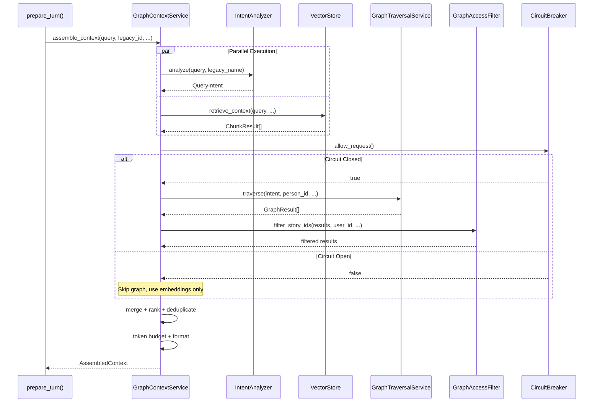
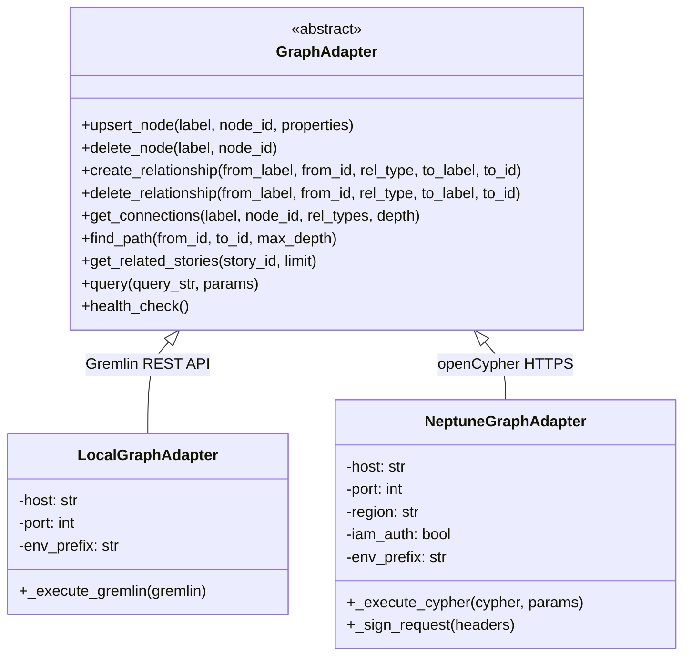
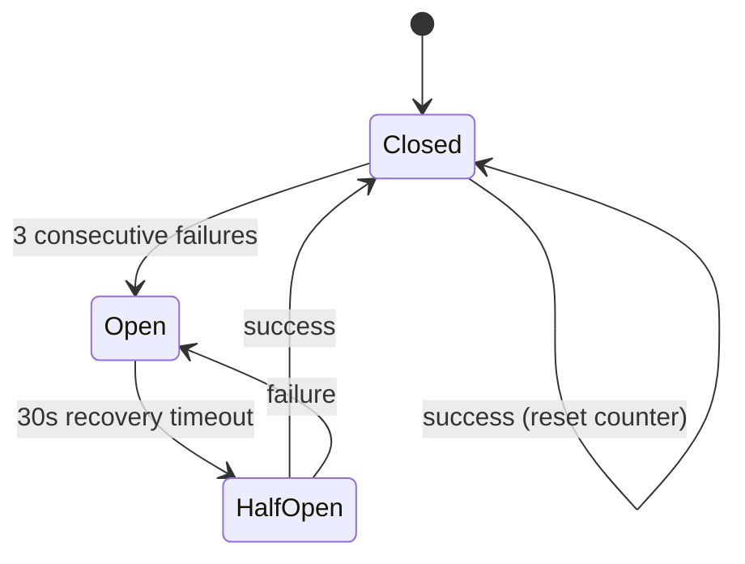
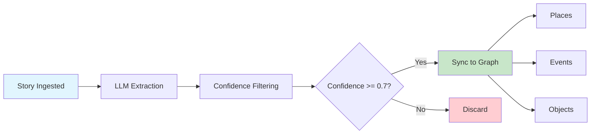

# Graph-Augmented RAG Architecture

The Graph-Augmented RAG system enhances AI persona conversations by combining pgvector embedding search with Neptune graph traversals. Instead of relying solely on vector similarity to find relevant story context, the system also traverses a knowledge graph of people, places, events, and objects extracted from stories — producing richer, more connected context for persona responses.

For the full design rationale, see the [design document](https://github.com/mosaic-stories/mosaic-life/blob/develop/docs/plans/2026-02-26-graph-augmented-rag-design.md).

## Processing Pipeline



**Pipeline steps:**

1. **Intent Analysis + Embedding Search** (parallel, ~200-400ms) — An LLM classifier identifies the query type (relational, temporal, spatial, entity-focused, general, or cross-legacy) and extracts mentioned entities. Simultaneously, pgvector retrieves embedding-similar story chunks.

2. **Graph Traversal** (~100-200ms) — Based on the classified intent, parameterized graph queries find connected stories through the knowledge graph. The persona's traversal configuration controls relationship weights, hop depth, and cross-legacy inclusion.

3. **Access Filtering** (~10ms) — Graph results are filtered against the user's visibility permissions using the same access rules as direct story queries.

4. **Merge + Rank + Deduplicate** (~5ms) — Embedding results and graph results are merged, scored, and deduplicated. Graph results get a boost based on hop distance and relationship weight.

5. **Token Budget + Format** (~5ms) — Results are trimmed to fit within the token budget (default 4000 tokens) and formatted for LLM prompt insertion.

## Key Services

| Service | File | Purpose |
|---------|------|---------|
| `GraphContextService` | `app/services/graph_context.py` | Orchestrates the full pipeline: parallel intent+embedding, graph traversal, filtering, ranking, formatting |
| `IntentAnalyzer` | `app/services/intent_analyzer.py` | LLM-based query classifier — identifies intent type and extracts entities |
| `GraphTraversalService` | `app/services/graph_traversal.py` | Maps `(QueryIntent, TraversalConfig)` to parameterized graph queries |
| `GraphAccessFilter` | `app/services/graph_context.py` | Filters graph-discovered story IDs against user visibility permissions |
| `EntityExtractionService` | `app/services/entity_extraction.py` | Extracts people, places, events, objects from story content at ingestion time |
| `CircuitBreaker` | `app/services/circuit_breaker.py` | Three-state fault tolerance for Neptune connectivity |

### Intent Types

The `IntentAnalyzer` classifies queries into one of six intent types, each triggering different graph traversal strategies:

| Intent | Example Query | Graph Strategy |
|--------|--------------|----------------|
| `relational` | "Tell me about Jim's family" | Traverse FAMILY_OF, KNEW edges from mentioned person |
| `temporal` | "What happened in the 1980s?" | Filter by time period properties on story nodes |
| `spatial` | "Stories about Chicago" | Traverse TOOK_PLACE_AT edges to place nodes |
| `entity_focused` | "Tell me more about the cabin" | Direct lookup of entity node + connected stories |
| `general` | "What else can you tell me?" | Broad traversal from current story context |
| `cross_legacy` | "Did grandma know Uncle Jim?" | Cross-legacy traversal through shared connections |

## Graph Adapters



- **`LocalGraphAdapter`** — Uses TinkerPop Gremlin Server's REST API (`POST /gremlin`). For local development only.
- **`NeptuneGraphAdapter`** — Uses AWS Neptune's openCypher HTTPS endpoint with optional IAM SigV4 signing.
- **`create_graph_adapter()`** factory in `app/adapters/graph_factory.py` selects the adapter based on configuration: Neptune when `NEPTUNE_HOST` is set, local TinkerPop otherwise. Returns `None` when graph augmentation is disabled.

### Environment Prefix Isolation

All labels and relationship types are prefixed with the environment name (e.g., `prod-Person`, `staging-FAMILY_OF`). This allows multiple environments to share a single Neptune cluster. The prefix is injected transparently by the adapter — callers always use unprefixed logical names.

## Persona Traversal Configuration

Each persona has a `TraversalConfig` in `app/config/personas.yaml` that shapes how graph queries are constructed:

| Setting | Biographer | Friend | Colleague | Family |
|---------|-----------|--------|-----------|--------|
| `max_hops` | 2 | 1 | 1 | 2 |
| `FAMILY_OF` weight | 1.0 | 0.5 | 0.2 | 1.0 |
| `KNEW` weight | 0.8 | 1.0 | 0.6 | 0.3 |
| `WORKED_WITH` weight | 0.7 | 0.4 | 1.0 | 0.2 |
| `FRIENDS_WITH` weight | 0.8 | 1.0 | 0.5 | 0.4 |
| `max_graph_results` | 20 | 15 | 15 | 20 |
| `include_cross_legacy` | true | true | false | true |
| `temporal_range` | full | recent | career | full |

These weights multiply with hop distance factors to produce a final relevance score:

```
relevance_score = hop_factor * relationship_weight + entity_match_bonus
```

Where `hop_factor` is `1.0` for 1-hop, `0.6` for 2-hop, and `0.3` beyond that. The `entity_match_bonus` of `0.2` is added when the traversed entity matches one extracted from the user's query.

## Circuit Breaker



The circuit breaker wraps all Neptune/graph operations. When Neptune is unavailable:

- After **3 consecutive failures**, the circuit opens and all graph operations are skipped.
- The system falls back to **embedding-only RAG** (the pre-graph behavior) with no user-visible degradation beyond slightly less connected suggestions.
- After **30 seconds**, the circuit transitions to half-open and allows one trial request.
- A successful trial closes the circuit and restores full graph-augmented behavior.

## Entity Extraction Pipeline



Entity extraction runs as a **best-effort** step during story ingestion. An LLM extracts people, places, events, objects, and time references from story content. Entities with confidence >= 0.7 are synced to the graph database as nodes with relationships to the story node.

For existing stories, the `scripts/backfill_entities.py` script processes all stories and populates the graph. A Kubernetes Job manifest is available for production backfill.

## Story Evolution Integration

Graph context enriches the story evolution pipeline at two points:

1. **Opening message** — When a user starts a conversation to evolve a story, `GraphContextService` is called with the story's content to discover connections. These are included in the system prompt so the persona can suggest graph-discovered exploration directions.

2. **Pre-summarization** — Before summarizing the conversation into story updates, a graph traversal discovers additional context from entities mentioned during the conversation. This is appended as "Additional Context from Connected Stories" to help the summarizer produce richer updates.

## Observability

### OpenTelemetry Spans

All services emit OTel spans under the `core-api.*` tracer namespace:

- `graph_context.assemble` — Full pipeline span with attributes for intent, result counts, latency
- `intent_analyzer.analyze` — Intent classification span
- `graph_traversal.traverse` — Graph query span
- `entity_extraction.extract` — Entity extraction span

### Prometheus Metrics

| Metric | Type | Labels | Description |
|--------|------|--------|-------------|
| `core_api_graph_context_latency_seconds` | Histogram | `phase` (total, graph) | Context assembly latency |
| `core_api_graph_context_results_total` | Counter | `source` (embedding, graph) | Results by source |
| `core_api_graph_context_circuit_state` | Gauge | `state` | Circuit breaker state (0=closed, 1=open, 2=half_open) |
| `core_api_entity_extraction_entities_total` | Counter | `type` (person, place, event, object) | Extracted entities |
| `core_api_neptune_query_latency_seconds` | Histogram | `query_type` (gremlin, cypher) | Neptune query latency |

### Debug Mode

Add `?debug=true` to persona chat endpoints to include `AssembledContext.metadata` in the response. This exposes intent classification, result counts, latency breakdown, and circuit breaker state for troubleshooting.

## Further Reading

- [Design Document](https://github.com/mosaic-stories/mosaic-life/blob/develop/docs/plans/2026-02-26-graph-augmented-rag-design.md) — Full design rationale, query templates, token budgeting details
- [Implementation Plan](https://github.com/mosaic-stories/mosaic-life/blob/develop/docs/plans/2026-02-26-graph-augmented-rag-plan.md) — Phase-by-phase implementation with 24 tasks
- [Graph RAG Configuration](graph-rag-configuration.md) — Environment variables, persona tuning, operations guide
