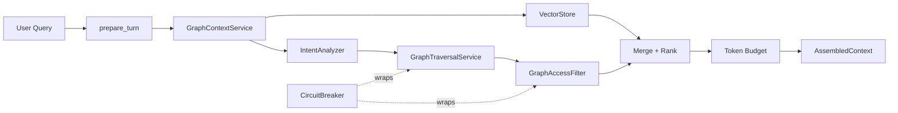

# Graph-Augmented RAG Overview

The Graph-Augmented RAG system (implemented February 2026) enhances AI persona conversations by combining pgvector embedding search with Neptune graph traversals. It discovers connections between people, places, events, and objects across stories to produce richer, more connected context for persona responses.

## Architecture Summary

The `GraphContextService` orchestrates the pipeline: parallel intent analysis and embedding search, followed by graph traversal, access filtering, merge/rank/deduplication, and token budget formatting. A circuit breaker provides graceful fallback to embedding-only when Neptune is unavailable.

## Key Files

| File | Purpose |
|------|---------|
| `services/core-api/app/services/graph_context.py` | GraphContextService orchestrator + GraphAccessFilter |
| `services/core-api/app/services/intent_analyzer.py` | LLM-based query intent classifier |
| `services/core-api/app/services/graph_traversal.py` | Maps intents to graph queries |
| `services/core-api/app/services/entity_extraction.py` | Extracts entities from stories at ingestion |
| `services/core-api/app/services/circuit_breaker.py` | Three-state circuit breaker |
| `services/core-api/app/adapters/graph_adapter.py` | GraphAdapter ABC |
| `services/core-api/app/adapters/local_graph.py` | TinkerPop/Gremlin adapter (local dev) |
| `services/core-api/app/adapters/neptune_graph.py` | AWS Neptune/openCypher adapter (production) |
| `services/core-api/app/adapters/graph_factory.py` | Factory: selects adapter based on config |
| `services/core-api/app/config/personas.yaml` | Persona definitions + traversal configs |
| `services/core-api/app/config/settings.py` | Neptune and graph settings (env vars) |
| `services/core-api/app/config/graph_suggestions.txt` | Graph suggestion directive for elicitation |
| `services/core-api/app/adapters/storytelling.py` | Integration point: prepare_turn() uses GraphContextService |
| `services/core-api/app/services/story_evolution.py` | Graph-enriched opening messages + pre-summarization |
| `services/core-api/app/services/ingestion.py` | Entity extraction during story ingestion |
| `services/core-api/app/observability/metrics.py` | Prometheus metrics for graph operations |
| `services/core-api/scripts/backfill_entities.py` | Backfill script for existing stories |

## Configuration Quick Reference

| Variable | Default | Description |
|----------|---------|-------------|
| `GRAPH_AUGMENTATION_ENABLED` | `true` | Master toggle for graph features |
| `NEPTUNE_HOST` | *(none)* | Neptune endpoint; unset = local TinkerPop |
| `NEPTUNE_PORT` | `8182` | Neptune/Gremlin port |
| `NEPTUNE_REGION` | `us-east-1` | AWS region for IAM auth |
| `NEPTUNE_IAM_AUTH` | `false` | Enable SigV4 signing |
| `NEPTUNE_ENV_PREFIX` | `local` | Label prefix for env isolation |
| `INTENT_ANALYSIS_MODEL_ID` | `claude-haiku-4-5` | Bedrock model for intent classification |
| `ENTITY_EXTRACTION_MODEL_ID` | `claude-haiku-4-5` | Bedrock model for entity extraction |

## Documentation

- **User Guide:** [AI Personas & Smart Connections](https://docs.mosaiclife.me/user-guide/ai-personas/) — End-user documentation
- **Architecture:** [Graph-Augmented RAG Architecture](https://docs.mosaiclife.me/developer-guide/graph-augmented-rag/) — Developer architecture reference
- **Configuration:** [Graph RAG Configuration & Operations](https://docs.mosaiclife.me/developer-guide/graph-rag-configuration/) — Admin/operator guide
- **Design Doc:** [docs/plans/2026-02-26-graph-augmented-rag-design.md](../plans/2026-02-26-graph-augmented-rag-design.md) — Full design rationale
- **Implementation Plan:** [docs/plans/2026-02-26-graph-augmented-rag-plan.md](../plans/2026-02-26-graph-augmented-rag-plan.md) — 24-task implementation plan (all phases complete)
