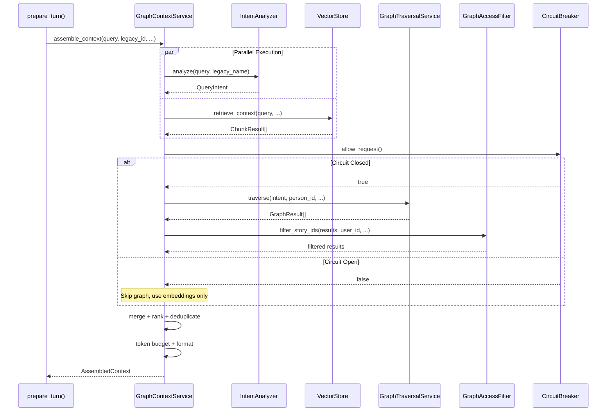
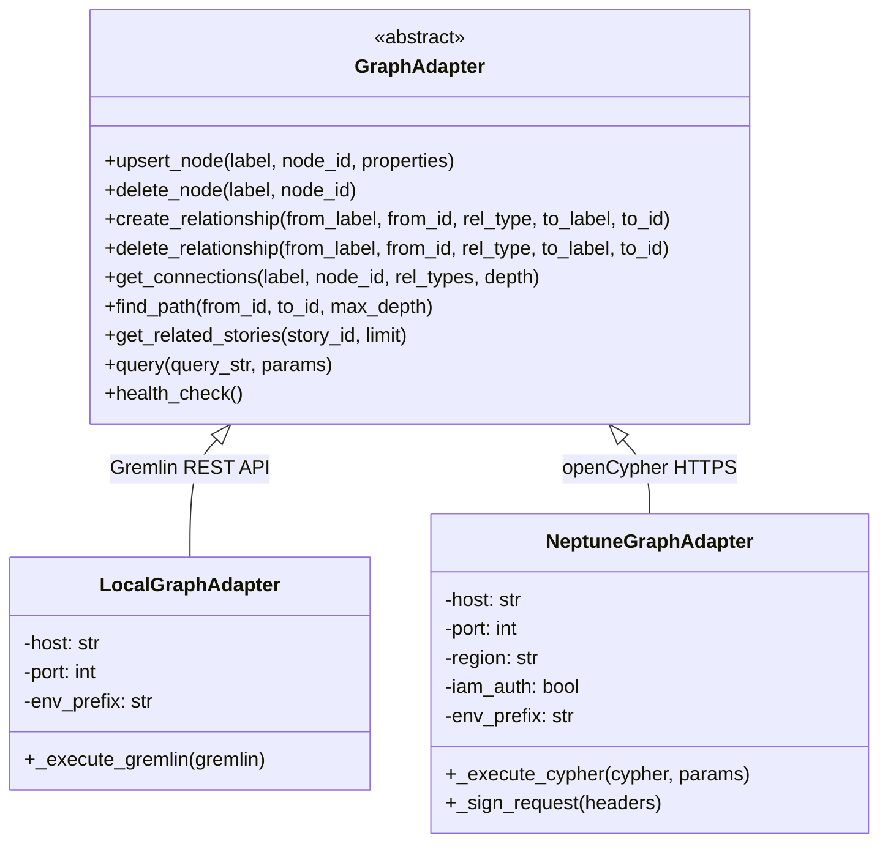
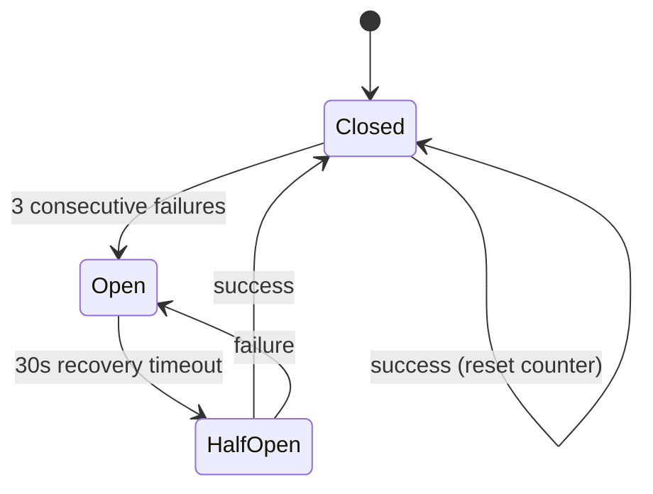
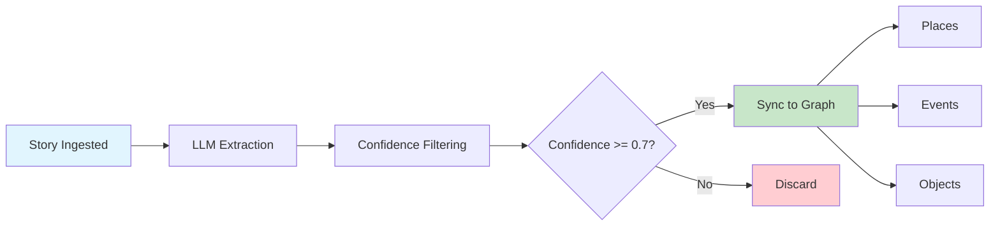
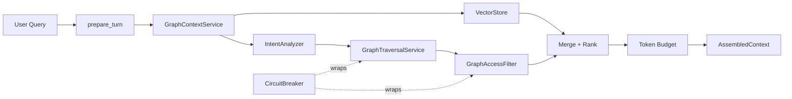

# Graph-Augmented RAG Documentation Implementation Plan

> **For Claude:** REQUIRED SUB-SKILL: Use superpowers:executing-plans to implement this plan task-by-task.

**Goal:** Create documentation for the completed Graph-Augmented RAG feature, covering end users, developers, and operators.

**Architecture:** Four feature-centric pages — one user-facing (MkDocs User Guide), two developer/operator-facing (MkDocs Developer Guide), and one repo-level overview (docs/architecture/). Plus a nav update to mkdocs.yml.

**Tech Stack:** Markdown, Mermaid diagrams, MkDocs Material theme

**Design Doc:** [docs/plans/2026-02-26-graph-augmented-rag-docs-design.md](2026-02-26-graph-augmented-rag-docs-design.md)

---

## Task 1: User Guide — AI Personas & Smart Connections ✅

**Files:**
- Create: `apps/docs/docs/user-guide/ai-personas.md`

**Step 1: Create the user-facing documentation page**

Create `apps/docs/docs/user-guide/ai-personas.md` with the following content:

```markdown
# AI Personas & Smart Connections

When you have a conversation about your loved one, Mosaic Life's AI personas draw on everything you've shared to provide meaningful, connected responses. Each persona brings a different perspective to your memories, and the system automatically discovers connections between stories, people, places, and events.

## Meet the Personas

| Persona | Focus | Best For |
|---------|-------|----------|
| **The Biographer** | Life Story Curator | Organizing memories into themes and timelines, identifying gaps in the narrative, connecting stories across life chapters |
| **The Friend** | Empathetic Listener | Emotional support during the memorial process, reflecting feelings, celebrating joyful memories alongside difficult ones |
| **The Colleague** | Professional Companion | Exploring career milestones, work relationships, mentorship stories, and professional impact |
| **The Family Member** | Family Historian | Family bonds and traditions, generational connections, holidays and gatherings, family roles |

Each persona uses the same underlying stories and memories, but approaches them from a different angle. Try switching personas to discover new dimensions of the stories you've shared.

## How Smart Connections Work

As you share stories, the system automatically identifies people, places, events, and meaningful objects mentioned in each memory. These are connected together behind the scenes, creating a web of relationships between your stories. When you mention Uncle Jim's trip to Chicago, the system can surface related stories about other family trips, other memories involving Uncle Jim, or even stories from other family members that took place in Chicago.

This means your conversations become richer over time. The more stories you share, the more connections the system can discover and suggest.

## What to Expect

- **Related stories in conversations** — When you're discussing a topic, the persona may reference other stories that connect to what you're talking about.
- **Exploration suggestions** — Personas may gently suggest directions to explore, like "There's another story about that same summer — would you like to talk about it?"
- **Cross-family connections** — If multiple family members have stories that intersect (same places, events, or people), the system can surface those connections.
- **Richer story evolution** — When you start a new conversation to expand on an existing story, the opening message reflects connections to related stories.

## Tips for Better Conversations

- **Share specific details** — Names, places, dates, and events help the system make stronger connections between stories.
- **Mention relationships** — Saying "my mother's brother Jim" gives the system more to work with than just "Jim."
- **Try different personas** — The Biographer might help you organize a timeline, while The Friend helps you process the emotions around the same memory.
- **Build on existing stories** — Use the story evolution feature to expand on stories you've already shared. The system will bring in relevant connections automatically.
- **Don't worry about order** — Share memories as they come to you. The system connects them regardless of when you share them.
```

**Step 2: Commit**

```bash
git add apps/docs/docs/user-guide/ai-personas.md
git commit -m "docs: add user guide for AI personas and smart connections"
```

---

## Task 2: Developer Guide — Graph-Augmented RAG Architecture ✅

**Files:**
- Create: `apps/docs/docs/developer-guide/graph-augmented-rag.md`

**Step 1: Create the developer architecture documentation page**

Create `apps/docs/docs/developer-guide/graph-augmented-rag.md` with the following content:

````markdown
# Graph-Augmented RAG Architecture

The Graph-Augmented RAG system enhances AI persona conversations by combining pgvector embedding search with Neptune graph traversals. Instead of relying solely on vector similarity to find relevant story context, the system also traverses a knowledge graph of people, places, events, and objects extracted from stories — producing richer, more connected context for persona responses.

For the full design rationale, see the [design document](https://github.com/mosaic-stories/mosaic-life/blob/develop/docs/plans/2026-02-26-graph-augmented-rag-design.md).

## Processing Pipeline



**Pipeline steps:**

1. **Intent Analysis + Embedding Search** (parallel, ~200-400ms) — An LLM classifier identifies the query type (relational, temporal, spatial, entity-focused, general, or cross-legacy) and extracts mentioned entities. Simultaneously, pgvector retrieves embedding-similar story chunks.

2. **Graph Traversal** (~100-200ms) — Based on the classified intent, parameterized graph queries find connected stories through the knowledge graph. The persona's traversal configuration controls relationship weights, hop depth, and cross-legacy inclusion.

3. **Access Filtering** (~10ms) — Graph results are filtered against the user's visibility permissions using the same access rules as direct story queries.

4. **Merge + Rank + Deduplicate** (~5ms) — Embedding results and graph results are merged, scored, and deduplicated. Graph results get a boost based on hop distance and relationship weight.

5. **Token Budget + Format** (~5ms) — Results are trimmed to fit within the token budget (default 4000 tokens) and formatted for LLM prompt insertion.

## Key Services

| Service | File | Purpose |
|---------|------|---------|
| `GraphContextService` | `app/services/graph_context.py` | Orchestrates the full pipeline: parallel intent+embedding, graph traversal, filtering, ranking, formatting |
| `IntentAnalyzer` | `app/services/intent_analyzer.py` | LLM-based query classifier — identifies intent type and extracts entities |
| `GraphTraversalService` | `app/services/graph_traversal.py` | Maps `(QueryIntent, TraversalConfig)` to parameterized graph queries |
| `GraphAccessFilter` | `app/services/graph_context.py` | Filters graph-discovered story IDs against user visibility permissions |
| `EntityExtractionService` | `app/services/entity_extraction.py` | Extracts people, places, events, objects from story content at ingestion time |
| `CircuitBreaker` | `app/services/circuit_breaker.py` | Three-state fault tolerance for Neptune connectivity |

### Intent Types

The `IntentAnalyzer` classifies queries into one of six intent types, each triggering different graph traversal strategies:

| Intent | Example Query | Graph Strategy |
|--------|--------------|----------------|
| `relational` | "Tell me about Jim's family" | Traverse FAMILY_OF, KNEW edges from mentioned person |
| `temporal` | "What happened in the 1980s?" | Filter by time period properties on story nodes |
| `spatial` | "Stories about Chicago" | Traverse TOOK_PLACE_AT edges to place nodes |
| `entity_focused` | "Tell me more about the cabin" | Direct lookup of entity node + connected stories |
| `general` | "What else can you tell me?" | Broad traversal from current story context |
| `cross_legacy` | "Did grandma know Uncle Jim?" | Cross-legacy traversal through shared connections |

## Graph Adapters



- **`LocalGraphAdapter`** — Uses TinkerPop Gremlin Server's REST API (`POST /gremlin`). For local development only.
- **`NeptuneGraphAdapter`** — Uses AWS Neptune's openCypher HTTPS endpoint with optional IAM SigV4 signing.
- **`create_graph_adapter()`** factory in `app/adapters/graph_factory.py` selects the adapter based on configuration: Neptune when `NEPTUNE_HOST` is set, local TinkerPop otherwise. Returns `None` when graph augmentation is disabled.

### Environment Prefix Isolation

All labels and relationship types are prefixed with the environment name (e.g., `prod-Person`, `staging-FAMILY_OF`). This allows multiple environments to share a single Neptune cluster. The prefix is injected transparently by the adapter — callers always use unprefixed logical names.

## Persona Traversal Configuration

Each persona has a `TraversalConfig` in `app/config/personas.yaml` that shapes how graph queries are constructed:

| Setting | Biographer | Friend | Colleague | Family |
|---------|-----------|--------|-----------|--------|
| `max_hops` | 2 | 1 | 1 | 2 |
| `FAMILY_OF` weight | 1.0 | 0.5 | 0.2 | 1.0 |
| `KNEW` weight | 0.8 | 1.0 | 0.6 | 0.3 |
| `WORKED_WITH` weight | 0.7 | 0.4 | 1.0 | 0.2 |
| `FRIENDS_WITH` weight | 0.8 | 1.0 | 0.5 | 0.4 |
| `max_graph_results` | 20 | 15 | 15 | 20 |
| `include_cross_legacy` | true | true | false | true |
| `temporal_range` | full | recent | career | full |

These weights multiply with hop distance factors to produce a final relevance score:

```
relevance_score = hop_factor * relationship_weight + entity_match_bonus
```

Where `hop_factor` is `1.0` for 1-hop, `0.6` for 2-hop, and `0.3` beyond that. The `entity_match_bonus` of `0.2` is added when the traversed entity matches one extracted from the user's query.

## Circuit Breaker



The circuit breaker wraps all Neptune/graph operations. When Neptune is unavailable:

- After **3 consecutive failures**, the circuit opens and all graph operations are skipped.
- The system falls back to **embedding-only RAG** (the pre-graph behavior) with no user-visible degradation beyond slightly less connected suggestions.
- After **30 seconds**, the circuit transitions to half-open and allows one trial request.
- A successful trial closes the circuit and restores full graph-augmented behavior.

## Entity Extraction Pipeline



Entity extraction runs as a **best-effort** step during story ingestion. An LLM extracts people, places, events, objects, and time references from story content. Entities with confidence >= 0.7 are synced to the graph database as nodes with relationships to the story node.

For existing stories, the `scripts/backfill_entities.py` script processes all stories and populates the graph. A Kubernetes Job manifest is available for production backfill.

## Story Evolution Integration

Graph context enriches the story evolution pipeline at two points:

1. **Opening message** — When a user starts a conversation to evolve a story, `GraphContextService` is called with the story's content to discover connections. These are included in the system prompt so the persona can suggest graph-discovered exploration directions.

2. **Pre-summarization** — Before summarizing the conversation into story updates, a graph traversal discovers additional context from entities mentioned during the conversation. This is appended as "Additional Context from Connected Stories" to help the summarizer produce richer updates.

## Observability

### OpenTelemetry Spans

All services emit OTel spans under the `core-api.*` tracer namespace:

- `graph_context.assemble` — Full pipeline span with attributes for intent, result counts, latency
- `intent_analyzer.analyze` — Intent classification span
- `graph_traversal.traverse` — Graph query span
- `entity_extraction.extract` — Entity extraction span

### Prometheus Metrics

| Metric | Type | Labels | Description |
|--------|------|--------|-------------|
| `core_api_graph_context_latency_seconds` | Histogram | `phase` (total, graph) | Context assembly latency |
| `core_api_graph_context_results_total` | Counter | `source` (embedding, graph) | Results by source |
| `core_api_graph_context_circuit_state` | Gauge | `state` | Circuit breaker state (0=closed, 1=open, 2=half_open) |
| `core_api_entity_extraction_entities_total` | Counter | `type` (person, place, event, object) | Extracted entities |
| `core_api_neptune_query_latency_seconds` | Histogram | `query_type` (gremlin, cypher) | Neptune query latency |

### Debug Mode

Add `?debug=true` to persona chat endpoints to include `AssembledContext.metadata` in the response. This exposes intent classification, result counts, latency breakdown, and circuit breaker state for troubleshooting.

## Further Reading

- [Design Document](https://github.com/mosaic-stories/mosaic-life/blob/develop/docs/plans/2026-02-26-graph-augmented-rag-design.md) — Full design rationale, query templates, token budgeting details
- [Implementation Plan](https://github.com/mosaic-stories/mosaic-life/blob/develop/docs/plans/2026-02-26-graph-augmented-rag-plan.md) — Phase-by-phase implementation with 24 tasks
- [Graph RAG Configuration](graph-rag-configuration.md) — Environment variables, persona tuning, operations guide
````

**Step 2: Commit**

```bash
git add apps/docs/docs/developer-guide/graph-augmented-rag.md
git commit -m "docs: add developer guide for graph-augmented RAG architecture"
```

---

## Task 3: Developer Guide — Graph RAG Configuration & Operations ✅

**Files:**
- Create: `apps/docs/docs/developer-guide/graph-rag-configuration.md`

**Step 1: Create the configuration and operations documentation page**

Create `apps/docs/docs/developer-guide/graph-rag-configuration.md` with the following content:

````markdown
# Graph RAG Configuration & Operations

This page covers environment variables, Neptune setup, persona tuning, and operational tasks for the graph-augmented RAG system. For architecture details, see [Graph-Augmented RAG Architecture](graph-augmented-rag.md).

## Environment Variables

| Variable | Default | Description |
|----------|---------|-------------|
| `GRAPH_AUGMENTATION_ENABLED` | `true` | Master toggle. Set to `false` to disable all graph features and fall back to embedding-only RAG. |
| `NEPTUNE_HOST` | *(none)* | Neptune cluster endpoint. When unset, the system uses a local TinkerPop Gremlin Server. |
| `NEPTUNE_PORT` | `8182` | Neptune/Gremlin Server port. |
| `NEPTUNE_REGION` | `us-east-1` | AWS region for Neptune IAM authentication. |
| `NEPTUNE_IAM_AUTH` | `false` | Enable IAM SigV4 request signing for Neptune. Required in production. |
| `NEPTUNE_ENV_PREFIX` | `local` | Environment prefix for label isolation (e.g., `prod`, `staging`). All graph labels are prefixed: `prod-Person`, `staging-FAMILY_OF`. |
| `INTENT_ANALYSIS_MODEL_ID` | `us.anthropic.claude-haiku-4-5-20251001-v1:0` | Bedrock model for query intent classification. Use a lightweight model for speed. |
| `ENTITY_EXTRACTION_MODEL_ID` | `us.anthropic.claude-haiku-4-5-20251001-v1:0` | Bedrock model for entity extraction during story ingestion. |

## Local Development Setup

### Starting Neptune (TinkerPop)

The local development stack uses TinkerPop Gremlin Server as a Neptune stand-in:

```bash
# Start the graph database
docker compose -f infra/compose/docker-compose.yml up -d neptune-local

# Verify it's running
curl http://localhost:18182
```

### Testing Connectivity

```bash
# Submit a basic Gremlin query
curl -X POST http://localhost:18182/gremlin \
  -H "Content-Type: application/json" \
  -d '{"gremlin": "g.V().count()"}'

# Expected response:
# {"requestId":"...","status":{"code":200},"result":{"data":[0]}}
```

### Local Environment Variables

No special configuration is needed for local development. When `NEPTUNE_HOST` is unset, the factory automatically creates a `LocalGraphAdapter` pointing to `localhost:18182` with `env_prefix=local`.

## Production Neptune Setup

### Cluster Requirements

- AWS Neptune with openCypher support
- IAM authentication enabled
- VPC peering or PrivateLink to EKS cluster
- The `neptune-connection` Kubernetes secret must contain: `host`, `port`, `region`, `iam_auth`, `env_prefix`

### IAM Authentication

In production, set `NEPTUNE_IAM_AUTH=true`. The `NeptuneGraphAdapter` signs requests using SigV4 with the pod's IAM role credentials (via IRSA). The service account needs the `neptune-db:*` permission on the cluster resource.

### Environment Prefix Isolation

The `NEPTUNE_ENV_PREFIX` setting prefixes all graph labels and relationship types. This allows multiple environments (prod, staging, dev) to share a single Neptune cluster:

- Production: `prod-Person`, `prod-FAMILY_OF`
- Staging: `staging-Person`, `staging-FAMILY_OF`
- Local: `local-Person`, `local-FAMILY_OF`

!!! warning "Prefix consistency"
    The prefix must be consistent across all services writing to the same graph. Changing the prefix after data has been written will make existing graph data invisible.

## Persona Tuning

Persona traversal behavior is configured in `services/core-api/app/config/personas.yaml` under the `traversal` key for each persona. Changes take effect on the next application restart.

### Traversal Settings

| Setting | Type | Description |
|---------|------|-------------|
| `max_hops` | int | Maximum graph traversal depth. Higher values discover more distant connections but increase latency. |
| `relationship_weights` | dict | Weight multipliers for each relationship type (0.0-1.0). Higher weight = stronger signal for that relationship. |
| `max_graph_results` | int | Maximum number of graph-discovered stories to return before access filtering. |
| `include_cross_legacy` | bool | Whether to traverse across different legacy subjects' story graphs. |
| `temporal_range` | string | Time range filter: `full` (all time), `recent` (last 10 years), `career` (working years). |

### Example: Making the Colleague Persona Broader

To make the Colleague persona discover more distant professional connections:

```yaml
colleague:
  traversal:
    max_hops: 2              # was 1 — now traverses 2 hops
    max_graph_results: 25     # was 15 — returns more results
    relationship_weights:
      FAMILY_OF: 0.2
      KNEW: 0.6
      WORKED_WITH: 1.0
      FRIENDS_WITH: 0.5
```

!!! note "Latency impact"
    Increasing `max_hops` from 1 to 2 roughly doubles graph traversal time. Monitor the `core_api_graph_context_latency_seconds` metric after changes.

### Example: Adding a New Relationship Type

To add support for a new relationship type (e.g., `MENTORED_BY`):

1. Add the weight to each persona's traversal config in `personas.yaml`
2. Ensure the entity extraction prompt in `app/services/entity_extraction.py` recognizes mentorship relationships
3. The graph traversal service will automatically include the new relationship type in queries

## Entity Backfill

When deploying graph augmentation for the first time, existing stories need entity extraction and graph population.

### Running Locally

```bash
cd services/core-api

# Preview what would be processed
uv run python scripts/backfill_entities.py --dry-run

# Process a small batch for testing
uv run python scripts/backfill_entities.py --limit 10

# Full backfill
uv run python scripts/backfill_entities.py
```

The script processes stories sequentially with a 0.5-second delay between each to avoid Bedrock throttling.

### Running in Production (Kubernetes Job)

Enable the backfill job in Helm values:

```yaml
# infra/helm/mosaic-life/values.yaml
entityBackfill:
  enabled: true
```

The job runs as a Helm post-install/post-upgrade hook. It uses the same container image as the core API service. Set `enabled: false` after the initial backfill completes.

## Circuit Breaker Behavior

The circuit breaker protects the system when Neptune is unavailable.

### States

| State | Behavior | Transition |
|-------|----------|------------|
| **Closed** | Normal operation — graph queries execute | Opens after 3 consecutive failures |
| **Open** | All graph queries skipped — embedding-only fallback | Transitions to half-open after 30 seconds |
| **Half-Open** | One trial request allowed | Success closes the circuit; failure reopens it |

### Monitoring

Use the Prometheus metric `core_api_graph_context_circuit_state` to monitor circuit breaker state:

- `0` = closed (healthy)
- `1` = open (Neptune unavailable, falling back)
- `2` = half-open (recovery attempt in progress)

Set up alerts for state `1` persisting beyond a few minutes — this indicates a Neptune connectivity issue that needs attention.

## Disabling Graph Augmentation

To disable all graph features and revert to embedding-only RAG:

```bash
GRAPH_AUGMENTATION_ENABLED=false
```

This is a clean toggle — the system behaves exactly as it did before graph augmentation was added. No other configuration changes are needed. Entity extraction during ingestion is also skipped.

## Troubleshooting

### Neptune Connectivity Failures

**Symptom:** Circuit breaker opens frequently, logs show `circuit_breaker.opened`.

**Check:**
```bash
# Local
curl http://localhost:18182

# Production — from a pod in the same VPC
curl https://<neptune-host>:8182/status
```

**Common causes:**
- Neptune cluster not running or unreachable
- Security group / VPC peering misconfigured
- IAM role missing `neptune-db:*` permissions

### High Graph Latency

**Symptom:** `core_api_graph_context_latency_seconds{phase="graph"}` consistently above 500ms.

**Check:**
- Reduce `max_hops` in persona traversal configs
- Reduce `max_graph_results`
- Check Neptune cluster instance size and CPU utilization

### Entity Extraction Returning Empty Results

**Symptom:** Stories are ingested but no entities appear in the graph.

**Check:**
- Verify `GRAPH_AUGMENTATION_ENABLED=true`
- Check Bedrock model access — the extraction model must be enabled in your AWS account
- Review logs for `entity_extraction.parse_failed` — the LLM response may not be valid JSON
- Try extracting manually: check the entity extraction service logs for the raw LLM response

### Circuit Breaker Stuck Open

**Symptom:** `core_api_graph_context_circuit_state{state="1"}` persists after Neptune is confirmed healthy.

**Resolution:** The circuit breaker automatically transitions to half-open after 30 seconds. If Neptune is healthy but the circuit remains open, the half-open trial request may be failing. Check Neptune logs for the specific query that fails. Restarting the core API pod resets the circuit breaker.

### Debug Mode

Add `?debug=true` to persona chat API calls to see the full context assembly metadata in the response, including:

- Intent classification and confidence
- Number of embedding vs. graph results
- Latency breakdown by phase
- Circuit breaker state
- Source types for each result
````

**Step 2: Commit**

```bash
git add apps/docs/docs/developer-guide/graph-rag-configuration.md
git commit -m "docs: add graph RAG configuration and operations guide"
```

---

## Task 4: Repo-Level Overview — Graph-Augmented RAG ✅

**Files:**
- Create: `docs/architecture/GRAPH-AUGMENTED-RAG.md`

**Step 1: Create the repo-level overview document**

Create `docs/architecture/GRAPH-AUGMENTED-RAG.md` with the following content:

````markdown
# Graph-Augmented RAG Overview

The Graph-Augmented RAG system (implemented February 2026) enhances AI persona conversations by combining pgvector embedding search with Neptune graph traversals. It discovers connections between people, places, events, and objects across stories to produce richer, more connected context for persona responses.

## Architecture Summary



The `GraphContextService` orchestrates the pipeline: parallel intent analysis and embedding search, followed by graph traversal, access filtering, merge/rank/deduplication, and token budget formatting. A circuit breaker provides graceful fallback to embedding-only when Neptune is unavailable.

## Key Files

| File | Purpose |
|------|---------|
| `services/core-api/app/services/graph_context.py` | GraphContextService orchestrator + GraphAccessFilter |
| `services/core-api/app/services/intent_analyzer.py` | LLM-based query intent classifier |
| `services/core-api/app/services/graph_traversal.py` | Maps intents to graph queries |
| `services/core-api/app/services/entity_extraction.py` | Extracts entities from stories at ingestion |
| `services/core-api/app/services/circuit_breaker.py` | Three-state circuit breaker |
| `services/core-api/app/adapters/graph_adapter.py` | GraphAdapter ABC |
| `services/core-api/app/adapters/local_graph.py` | TinkerPop/Gremlin adapter (local dev) |
| `services/core-api/app/adapters/neptune_graph.py` | AWS Neptune/openCypher adapter (production) |
| `services/core-api/app/adapters/graph_factory.py` | Factory: selects adapter based on config |
| `services/core-api/app/config/personas.yaml` | Persona definitions + traversal configs |
| `services/core-api/app/config/settings.py` | Neptune and graph settings (env vars) |
| `services/core-api/app/config/graph_suggestions.txt` | Graph suggestion directive for elicitation |
| `services/core-api/app/adapters/storytelling.py` | Integration point: prepare_turn() uses GraphContextService |
| `services/core-api/app/services/story_evolution.py` | Graph-enriched opening messages + pre-summarization |
| `services/core-api/app/services/ingestion.py` | Entity extraction during story ingestion |
| `services/core-api/app/observability/metrics.py` | Prometheus metrics for graph operations |
| `services/core-api/scripts/backfill_entities.py` | Backfill script for existing stories |

## Configuration Quick Reference

| Variable | Default | Description |
|----------|---------|-------------|
| `GRAPH_AUGMENTATION_ENABLED` | `true` | Master toggle for graph features |
| `NEPTUNE_HOST` | *(none)* | Neptune endpoint; unset = local TinkerPop |
| `NEPTUNE_PORT` | `8182` | Neptune/Gremlin port |
| `NEPTUNE_REGION` | `us-east-1` | AWS region for IAM auth |
| `NEPTUNE_IAM_AUTH` | `false` | Enable SigV4 signing |
| `NEPTUNE_ENV_PREFIX` | `local` | Label prefix for env isolation |
| `INTENT_ANALYSIS_MODEL_ID` | `claude-haiku-4-5` | Bedrock model for intent classification |
| `ENTITY_EXTRACTION_MODEL_ID` | `claude-haiku-4-5` | Bedrock model for entity extraction |

## Documentation

- **User Guide:** [AI Personas & Smart Connections](https://docs.mosaiclife.me/user-guide/ai-personas/) — End-user documentation
- **Architecture:** [Graph-Augmented RAG Architecture](https://docs.mosaiclife.me/developer-guide/graph-augmented-rag/) — Developer architecture reference
- **Configuration:** [Graph RAG Configuration & Operations](https://docs.mosaiclife.me/developer-guide/graph-rag-configuration/) — Admin/operator guide
- **Design Doc:** [docs/plans/2026-02-26-graph-augmented-rag-design.md](../plans/2026-02-26-graph-augmented-rag-design.md) — Full design rationale
- **Implementation Plan:** [docs/plans/2026-02-26-graph-augmented-rag-plan.md](../plans/2026-02-26-graph-augmented-rag-plan.md) — 24-task implementation plan (all phases complete)
````

**Step 2: Commit**

```bash
git add docs/architecture/GRAPH-AUGMENTED-RAG.md
git commit -m "docs: add repo-level graph-augmented RAG overview"
```

---

## Task 5: Update MkDocs Navigation ✅

**Files:**
- Modify: `apps/docs/mkdocs.yml:103-122`

**Step 1: Add new pages to the MkDocs nav**

In `apps/docs/mkdocs.yml`, update the `nav` section (lines 103-122) to include the three new pages:

```yaml
nav:
  - Home: index.md
  - Getting Started:
    - Installation: getting-started/installation.md
    - First Steps: getting-started/first-steps.md
  - User Guide:
    - Creating Stories: user-guide/creating-stories.md
    - Sharing Memories: user-guide/sharing-memories.md
    - AI Personas & Smart Connections: user-guide/ai-personas.md
  - Developer Guide:
    - Environment Setup: developer-guide/environment-setup.md
    - Local Setup: developer-guide/local-setup.md
    - Architecture: developer-guide/architecture.md
    - Graph-Augmented RAG: developer-guide/graph-augmented-rag.md
    - Graph RAG Configuration: developer-guide/graph-rag-configuration.md
    - Contributing: developer-guide/contributing.md
  - API Reference:
    - Overview: api/overview.md
    - OpenAPI: api/openapi.md
  - Code Reference:
    - Python: reference/python/index.md
    - TypeScript: reference/typescript/index.md
  - Changelog: changelog.md
```

**Step 2: Validate MkDocs builds**

Run: `cd apps/docs && uv run mkdocs build --strict 2>&1 | tail -20`
Expected: Build succeeds with no errors. Warnings about missing pages in other sections are acceptable.

**Step 3: Commit**

```bash
git add apps/docs/mkdocs.yml
git commit -m "docs: add graph RAG pages to MkDocs navigation"
```
